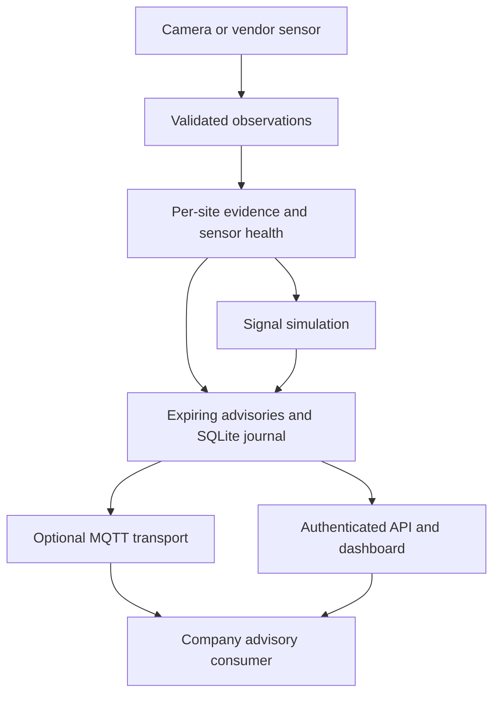

# Company integration guide

## Architecture and boundary



The service observes and advises. Its signal phases represent a single movement for software testing, not a multi-approach intersection plan. There are no GPIO, NTCIP, vehicle-control or radio-V2X outputs. The consuming company's controller remains responsible for its own interlocks, collision monitoring, pedestrian phases, preemption and loss-of-communications behavior.

All sites have independent configuration, confirmation history, signal state and holds. Required sensors use AND health logic: one functioning view does not conceal a blind required view. Positive confirmed evidence from any sensor can warn about an animal even when another sensor has failed.

## Implement a sensor adapter

1. Choose site and sensor IDs and a credential scoped exactly to `site/sensor`.
2. Calibrate the image-space ROI. The box's bottom-center must lie inside the normalized polygon. Radar needs an independently validated mapping or an upstream classifier; raw range returns are not wildlife classifications.
3. Send one full observation per acquired frame or measurement window. An empty list means a successfully observed window with no classified animals. Send `healthy:false` for failed inference, obstructed sensors or inadequate acquisition; do not use an empty list to hide failure.
4. Include the actual acquisition time as an offset-aware ISO 8601 timestamp. Keep UTC synchronized. Timestamps must strictly increase per sensor, including across service restarts; use unique observation IDs.
5. State the measured conditions. Unsupported conditions fault the sensor. `unknown` is not considered valid unless explicitly accepted in the site's envelope.
6. Retain the exact ID, payload and timestamp for a retry. An identical fresh retry is ignored and cannot confirm an animal or extend coverage. New IDs with old timestamps are rejected. Do not retimestamp old footage as live.
7. Preserve the operational envelope and model provenance in your own release record. The service trusts the authenticated adapter's semantic claims; token checks cannot prove a frame depicts reality.

```json
{
  "schema_version": 1,
  "observation_id": "camera-north-00042",
  "site_id": "corridor-demo",
  "sensor_id": "north",
  "observed_at": "2026-09-10T12:00:00.200Z",
  "healthy": true,
  "conditions": "dry",
  "detections": [
    {"label": "deer", "confidence": 0.93, "bbox": [0.2, 0.3, 0.7, 0.8], "evidence": "classified"}
  ]
}
```

The fixed timestamp above is illustrative and will be rejected when stale. `examples/send_observations.py` supplies current timestamps.

Boxes are normalized x1,y1,x2,y2, not pixels, GPS coordinates, vehicle trajectories or estimated distance. Species are lowercase. At most 100 detections and 64 KiB per request. The service admits at most max(60, 2 × configured max_fps) requests per sensor per second, including retries. Install a gateway rate limit as well.

## Consume advisories

HTTP uses `Authorization: Bearer <read key>`. MQTT publishes to `<prefix>/<site_id>` with MQTT 5 expiry, QoS 1 and retain disabled. Configure TLS or mTLS; unauthenticated loopback is an explicit lab-only option. Broker ACLs, topic ownership and TLS termination remain your deployment's responsibility.

Use [the event schema](../schemas/event.schema.json). HTTP/MQTT transport envelopes add a monotonically increasing `sequence` from this database. To validate the event schema, remove the transport `sequence` field first. Use `event_id` for deduplication. QoS 1 and reconnects can duplicate delivery.

For each site, retain the newest sequence only. Check `expires_at` against synchronized time and discard expired entries. An expired or missing advisory means **unknown**, not a clear road. After restoring an older database, rotate consumer cursor state: sequence numbers belong to that database's history.

`GET /events?after=<cursor>&limit=100&active_only=true` returns ascending events and `next_cursor`. Continue paging while the page is full. The default excludes expired events; `active_only=false` is an authenticated historical journal, never a live road-safety feed. Retention/row limits can drop undelivered old entries; delivery is best-effort within TTL, not guaranteed during an outage. Fetch `/status` when resynchronizing.

| Event type | Interpretation |
| --- | --- |
| wildlife_detected | Confirmed recent classification in the configured ROI |
| monitoring_unavailable | At least one required sensor or service health check failed |
| operator_hold | A persisted operator hold is active |
| no_recent_detection | No recent confirmed evidence; wildlife absence is not guaranteed |

A wildlife warning can have `monitoring_healthy:false`; show the warning and degraded coverage together. Always honor `physical_control:false` and `phase_is_simulated:true`.

## API and permissions

| Route | Permission | Result |
| --- | --- | --- |
| GET /healthz | Public | Process responds |
| GET /readyz | Public | 200 only when every site's required coverage is healthy and holds are clear |
| GET /status | Reader/operator | Current per-site state and faults |
| GET /events | Reader/operator | Cursor-based expiring or historical advisories |
| GET /hotspots | Reader/operator | Configured circular corridor centers as GeoJSON Points |
| GET /risk?lat=...&lon=...&at=... | Reader/operator | Uncalibrated index; null outside coverage |
| GET /metrics | Reader/operator | Process counters and per-site health |
| POST /v1/observations | Scoped sensor | Validated ingestion; 409 stale/replay conflict, 429 rate limit |
| POST /v1/sites/{id}/hold | Operator only | Persist hold/release plus audit reason |

Configure distinct reader and optional operator credentials and a JSON object of scoped sensor credentials using the environment variable names in AppConfig. Operators cannot masquerade as sensors. Readers cannot change holds. No default credential is embedded. Changing credentials requires a restart. For enterprise identities, put the service behind your authenticated gateway rather than claiming it contains SSO or a full identity-management system.

The risk index is a transparent additive heuristic: configured base, +15 for configured months, +15 for configured local hours, +40 for recent live detections, capped at 100. It is not a percentage or collision probability. Fixed hour windows are not astronomical dawn/dusk. Queries more than 60 seconds from service time use configured seasonality only, not current detections.

## Persistence and failure behavior

SQLite uses WAL and FULL synchronization. A process ownership lock rejects a second writer. Observation IDs/digests and timestamp watermarks prevent retries/replays; raw video and individual bounding boxes are not persisted. Holds and audit reasons survive restart. Sensor health and confirmation histories deliberately start unknown after restart.

A wall-clock step greater than two seconds relative to monotonic time latches a clock fault. Restore synchronization and restart. Timer logic uses monotonic time; model temperatures are never generated. Storage errors return an unavailable response and latch a fault rather than presenting reliable monitoring.

Traffic evidence is held for `clear_s` after the last confirmed observation. The signal simulator separately requires a continuous clear interval and minimum crossing hold before releasing through RED. A prolonged occupancy raises `occupancy_overdue`; it never forces green. This conservative sequencing still does not supply a deployable intersection controller.

## Extension responsibilities

Companies can add vendor-specific sensor adapters, replace the inference backend, train regional models, consume advisories in an ATMS, or evaluate a licensed V2X gateway. Each integration needs its own contract tests, hardware-in-the-loop evidence and field acceptance criteria. MQTT JSON is not SAE J2735, ETSI ITS or certified C-V2X/DSRC. No automatic braking or emergency-vehicle authentication is provided.

The standalone health and vaccination modules are metadata/research utilities only. They are not part of sensor-triggered traffic actions or an agency intervention workflow.
